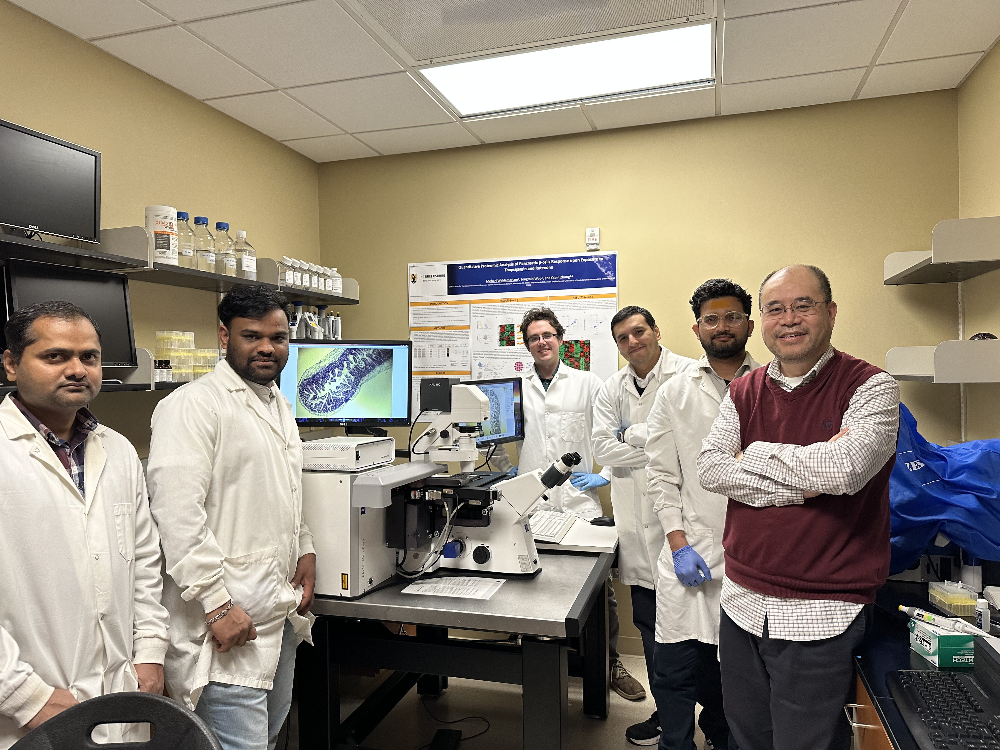

---
# Leave the homepage title empty to use the site title
title:
date: 2025-05-24
type: landing

sections:
  - block: markdown
    id: home
    content:
      title: |
        About Us
      
      text: |
         
        
        Our research group focuses on developing new mass spectrometric capabilities for measurement of biomolecules and the clinical applications of proteomics, lipidomics, and metabolomics. We aim for identification of early stage disease biomarkers and systems biological understanding of the pathogenic mechanisms underlying human diseases. 

        

  
  - block: collection
    id: news
    content:
      title: Latest News
      subtitle:
      text:
      count: 5
      filters:
        author: ''
        category: ''
        exclude_featured: false
        publication_type: ''
        tag: ''
      offset: 0
      order: desc
      page_type: post
    design:
      view: card
      columns: '1'

  - block: people
    id: people
    content:
      title: Meet the Team
      # Choose which groups/teams of users to display.
      #   Edit `user_groups` in each user's profile to add them to one or more of these groups.
      user_groups:
          - Principal Investigator
          - Researchers
          - Grad Students
          - Administration
          - Visitors
          - Alumni
      sort_by: Params.last_name
      sort_ascending: true
    design:
      show_interests: false
      show_role: true
      show_social: true

  - block: markdown
    id: research
    content:
      title: Proteomic method development
      text: |-
        

          

            

              Analytical method development is driven by biomedical needs in measurement sensitivity, specificity and throughout. Many post-translational modifications to proteins are low abundant, accurate analysis of protein PTM requires specific enrichment methods. We developed online boronic affinity enrichment method for 2DLC-MS/MS analysis of glycated proteins, which has been used in identification of biomarkers to glycemic control and diabetic complications. We also developed laser capture microdissection-based methods for spatial proteomics to investigate the pathologies assoicated with specific cell types in a tissue. In addition, we developed highthroughout workflows for proteomic analysis of plasma and dried blood spot samples with improved proteome coverage, reproducibility and robustness. Continous method development is focused on proteomics for organelles, extracellular vesicles, and protein post-translational modifications.
            

          

          

            
          

        

  - block: markdown
    content:
      title: Lipidomic method development
      text: |-
        

          

            
          

          

            

              Lipids are structurally very diverse molecules. Different classes of lipids have different chemical properties, which makes their separation and identification from a complex biological sample very challenging.  We developed methods for comprehensive lipidomic analysis, which include offline 2DLC separation coupled with high resolution mass spectrometry, novel ion chemistry OzNOxESI for determination of C=C position within unsaturated lipids, isobaric chemical labeling for more sensitive and multiplexed analysis of gangliosides, and very specific method for distinguishing isomeric oxylipins. Continued method development is focused on absolute quantification of lipids, lipidomics of tissue sections and extracellular vesicles, and modified lipids. 
            

          

        

  - block: markdown
    content:
      title: Biomarkers and pathogenic mechanisms for human diseases
      text: |-
        

          

            

              Reliable biomarkers are greatly needed in clinics for early diagnosis of human diseases. Our lab is the first that reported the most comprehensive profiling of longitudinal changes in plasma proteome during childhood development. Applying proteomics and lipidomics, we have identified panels of proteins that predict the onset of type 1 diabetes, diabetic complications and established gangliosides as a critical factor in hepatitus A virus entry into the host cells. Current research is focused on immunopeptides as neoantigens in type 1 diabetes, markers and mechanisms for tissue-specific diabetic complications and alcoholic heart diseases.
            

          

          

            
          

        

  - block: markdown
    content:
      title: Molecular assessment of human performance
      text: |-
        

          

            

              We developed novel omics marker panels for assessment of the immunity and inflammatory status. Through close collaboration with the Human Performance Lab of the Applacchian State University, we assessed the effect of consumption of various functional foods on boosting immunity and resolving inflammation induced by intensive exercises. Currently we are working with the Naval Health Research Center to evaluate the nutritional interventions to militrary training. 
            

          

          

            
          

        

  - block: markdown
    content:
      title: Informatics
      text: |-
        

          

            
          

          

            

              We developed <a href="https://github.com/QibinZhangLab">software tools</a> for automated processing of isotopic labeling mass spectrometry data and of the data generated by the novel OzNOxESI ion chemistry for C=C position analysis in lipids. Developing niche software to facilitate mass spectrometric data processing and data visualization will be a continous focus area of our research.
            

          

        

  - block: markdown
    id: apply
    content:
      title: Join Us
      text: We always welcome talented researchers to join our lab! Graduate students who wish to pursue a PhD or MS degree in Chemistry, please submit your application through the [graduate programs](https://chem.uncg.edu/#academics) in the Department of Chemistry & Biochemistry of UNCG. If you are interested in joining us as a postdoctoral researcher or a research scientist, please contact Dr. Zhang, including a CV, a statement of your research interests and skills and how they align with our research projects.

  - block: contact
    id: contact
    content:
      title: Contact
      text: |-
        Our research lab is in the UNCG Center for Translational Biomedical Research, located on the beautiful North Carolina Research Campus in the thriving downtown Kannapolis, a suburb of Charlotte.
      email: q_zhang2@uncg.edu
      phone: 704-250-5803
      address:
        street: 600 Laureate Way
        city: Kannapolis
        region: NC
        postcode: '28081'
        country: United States
        country_code: US
      coordinates:
        latitude: '35.50157'
        longitude: '-80.62401'
      office_hours:
        - 'M-F 9:00 to 6:00'

      # Automatically link email and phone or display as text?
      autolink: true
    
    design:
      columns: '1'
---

[def]: uploads/Human performance.pn